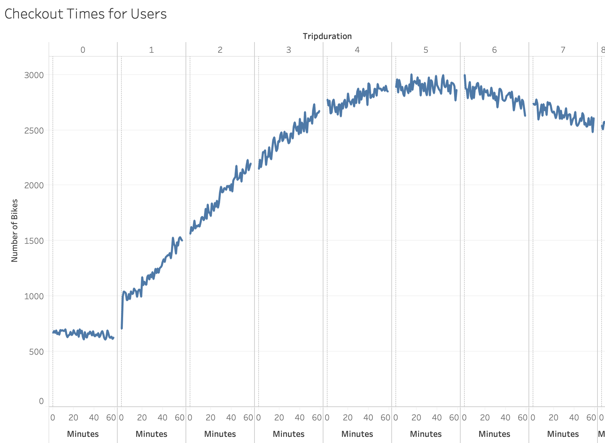
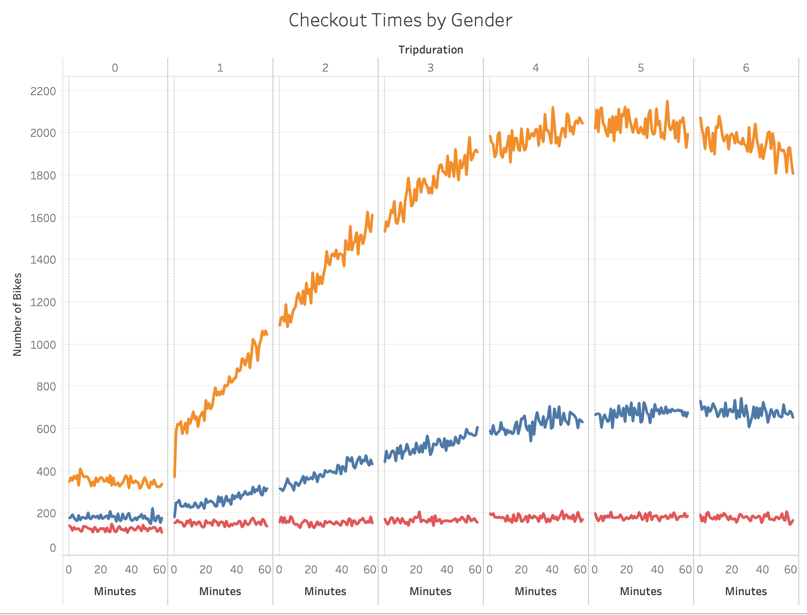

# bikesharing
## OVERVIEW
This is an analysis to gather statistical information for Citibike in NYC to make a case for bike sharing in Des Moines.

## RESULTS

The first analysis shows the trip duration for each rental based on each hour. 

Similarly to the first analysis, the second one breaks down the durations by gender

The thrid aalysis is a heat map of stop times based on each weekday for each hour of day

The fourth analysis is a similar heat map that is broken down by gender

The fifth analysis is a heat map that breaks down use by gender and user type for each day of the week

The sixth analysis is a pie chard to show the breakdown of different genders

This is a map of different starting points, showing the circle sizes per starting point.

(Here is a link to the dashboard)[https://public.tableau.com/profile/hamze5024#!/vizhome/BikeSharing2_16065297126840/CitibikeStatistics?publish=yes]
